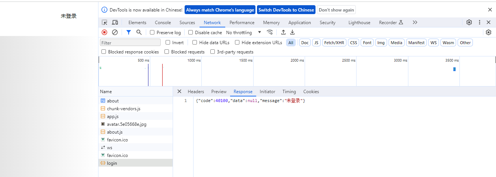

# yuoj-frontend

## Project setup
```
npm install
```

### Compiles and hot-reloads for development
```
npm run serve
```

### Compiles and minifies for production
```
npm run build
```

### Lints and fixes files
```
npm run lint
```

### Customize configuration
See [Configuration Reference](https://cli.vuejs.org/config/).

### 1、定义全局变量
```
const state = () => ({
  all: []
})
```
state表示一旦被赋值后就不能被更改了
()=>{}箭头函数中，()里面的内容是参数，{}表示的是返回的对象；

### 2、权限管理
（1）对访问需要权限的页面，在路由页面中加一个权限meta，只有access="canAdmin"才可以访问,
```
{
    path: "/admin",
    name: "管理员可见",
    component: AdminView,
    meta: {
      access: "canAdmin",
    },
```
（2）加一个全局机制，全局机制写在app.vue中，用户每次访问这个页面时，判断是否有这个页面路由对应的权限，如果有的话就允许访问，如果没有就跳转到其它页面（404）
```
const route = useRouter();
const store = useStore();
route.beforeEach((to, from, next) => {
  //仅管理员可见，判断当前用户是否有权限
  if (to.meta?.access === "canAdmin") {
    if (store.state.user.loginUser?.role !== "admin") {
      next("/noAuth");
      //跳转到无权限页面
      return;
    }
  }
  next();
});
```

### 3、页面的显隐
（1）对需要权限隐藏的页面，同样使用meta，定义只有hideInMenu=true才能显示在页面上
```
  {
    path: "/hide",
    name: "隐藏页面",
    component: HomeView,
    meta: {
      hideInMenu: true,
    },
```
（2）使用过滤器过滤身份，括号函数里面会返回T/F给过滤器，只要返回值为true就说明这个元素要保留，否则就会过滤掉。假设要隐藏一个页面，也就是页面有定义hideInMenu=true，那么返回false将页面过滤掉，之后遍历visibleRoutes就不会考虑它了。
```
  const visibleRoutes = routes.filter((item, index) => {
  if (item.meta?.hideInMenu) {
    return false;
  }
  return true;
});
```
（3）前端展示
```
  <a-menu-item v-for="item in visibleRoutes" :key="item.path">
    {{ item.name }}
  </a-menu-item>
```

### 4、全局权限管理
因为菜单组件中要判断权限，权限拦截也要用到权限判断功能，所以抽离成公共方法
（1）权限定义，并且export default公开
```dockerignore
const ACCESS_ENUM = {
  NOT_LOGIN: "notlogin",
  USER: "user",
  ADMIN: "admin",
};

export default ACCESS_ENUM;
```

（2）定义权限页面
```
import AccessEnum from "@/access/accessEnum";

/**
 *检查权限，判断用户是否具有某个权限
 * @param loginuser 当前登录用户
 * @param needAccess 需要有的权限 默认值是不需要权限
 * @return boolean 有无权限
 */
const checkAccess = (loginuser: any, needAccess = ACCESS_ENUM.NOT_LOGIN) => {
  //获取当前登陆用户的权限，假设loginUser或userRole为空，说明现在没有用户，给他一个默认值NOT_LOGIN；
  const LoginUserAccess = loginuser?.userRole ?? ACCESS_ENUM.NOT_LOGIN;

  //假设需要的权限是NOT_LOGIN,因为默认值已经是这个，直接返回true
  if (needAccess === ACCESS_ENUM.NOT_LOGIN) {
    return true;
  }

  //如果需要用户登录才能访问
  if (needAccess === ACCESS_ENUM.USER) {
    //如果用户没登录，说明没有权限
    if (LoginUserAccess === ACCESS_ENUM.NOT_LOGIN) {
      return false;
    }
  }

  //如果需要的权限是管理员
  if (needAccess === ACCESS_ENUM.ADMIN) {
    if (LoginUserAccess !== AccessEnum.ADMIN) {
      return false;
    }
  }

  //return true写在这里，不用全部在剩下的两个if语句中再写一遍。
  return true;
};

export default checkAccess;
//需要导出才能够给其它函数用
```

### 5、权限改变时页面改变
（1）computed()根据值的变化去动态计算值的变量，当setTime里面userRole改变时，computed也会动态改变filter
```
//显示在菜单的路由数组
const visibleRoutes = computed(() => {
  return routes.filter((item, index) => {
    if (item.meta?.hideInMenu) {
      return false;
    }
    //todo 根据权限校验菜单,此时没有管理员权限，管理员页面会被过滤掉
    //item?.meta?.access 会出现报错：Argument of type unknown is not assignable to parameter of type string(未知类型无法赋值给string参数)，所以加一个强制转换。
    if (
      !checkAccess(store.state.user.loginUser, item?.meta?.access as string)
    ) {
      return false;
    }
    return true;
  });
});


setTimeout(() => {
  //dispathch函数用于触发actions，type用于选择actions中的函数，payload用于传递给actions的载荷
  store.dispatch("user/getLoginUser", {
    userName: "管理员下饭厨神吞罗",
    userRole: ACCESS_ENUM.ADMIN,
  });
}, 3000);
```

### 6、全局项目入口
app.vue:
```dockerignore
const doInit = () => {
  console.log("原神，启动！");
};

onMounted(() => {
  doInit();
});
```

### 7、axios
```dockerignore
npm install axios
```

### 8、openapi
（1）https://github.com/ferdikoomen/openapi-typescript-codegen
```
npm install openapi-typescript-codegen --save-dev

openapi --input ./spec.json --output ./generated --client xhr
//对以上命令适当修改，直接在命令行运行。input部分修改的是要传入的文档，output部分不用改，因为是要生成的；xhr改为axios，表示要生成该类型的代码
openapi --input http://localhost:8121/api//v2/api-docs --output ./generated --client axios
后端文档更新时，再执行一下这个命令会自动再重新更新接口命令，结果保存在/generated/services
```

（2）/store/user.ts 进行后端调用。这部分UserControllerService.getLoginUserUsingGet()直接调用生成的Service代码
```
  actions: {
    //前后端调用响应不会立刻完成，所以要设置为async异步函数
    async getLoginUser({ commit, state }, payload) {
      const res = await UserControllerService.getLoginUserUsingGet();
      if (res.code === 0) {
        commit("updateUser", res.data);
      } else {
        //登录失败，...表示还是获取之前的用户信息，之后给它一个userRole为未登录的信息。
        commit("updateUser", {
          ...state.loginUser,
          userRole: ACCESS_ENUM.NOT_LOGIN,
        });
      }
    },
  },
```

（3）F12 Network 此时前后端对接完成。


### 9、全局状态下的多种框架
route.ts:

（1）在路由文件中新建一套用户路由，使用子路由，实现用户路由自身的布局。
```
{
    path: "/user",
    name: "用户",
    component: UserLayout,
    children: [
      {
        path: "/user/login",
        name: "用户登录",
        component: UserLoginView,
      },
      {
        path: "/user/register",
        name: "用户注册",
        component: UserRegisterView,
      },
    ],
  },
```

App.vue:

（1）
```dockerignore
const route=useRoute();
```
（2）使用v-if判断,如果路径是以user开头，那么用它自己的组件。
```dockerignore
<template>
  <div id="app">
    <template v-if="route.path.startsWith('/user')">
      <router-view />
    </template>
    <template v-else>
      <BasicLayout />
    </template>
  </div>
</template>
```